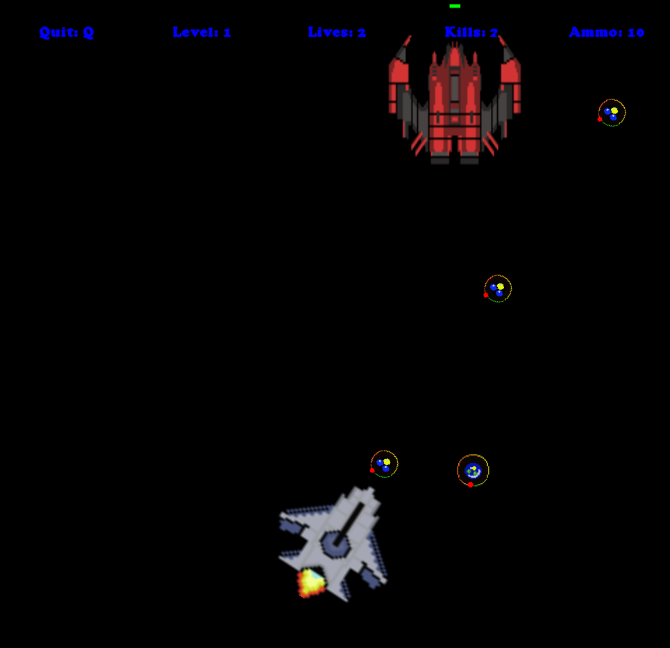

# Antimatter Annihilators

A game similar to Space Invaders. The purpose of this project was to implement object-orientation, inheritance and polymorphism. As such, game design wasn't so much the focus of the project - gameplay mechanics are somewhat lacking and need work.

## About

To run the game, double-click ```annihilators.jar```.

## Screenshots

Main menu:
![menu.png]

Gameplay:
![bunkers.png]

Boss:
![boss.png]
